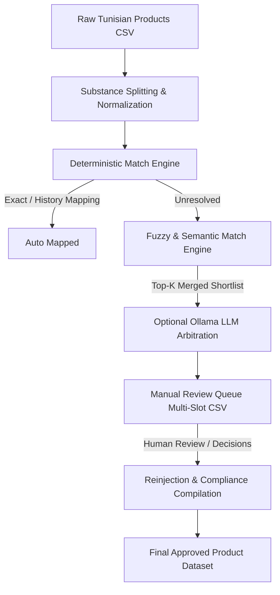

# Tunisian Pesticides Reconciliation Pipeline

A robust, modular, and local-first data-engineering pipeline to reconcile Tunisian pesticide commercial product active substances with the official European Union (EU) active substances database.

---

## Architecture Overview



1. **Deterministic Matching**: Validates exact normalized names and checks mapping history (`manual_mapping.csv`).
2. **Fuzzy & Semantic Matching**: Matches remaining names against the EU database. Combines string-similarity (`rapidfuzz`) with vector cosine similarity (`nomic-embed-text` embeddings from a local Ollama index).
3. **Optional LLM Disambiguation**: For ambiguous cases (scores under 75%), a local LLM (`qwen3:14b`) handles candidate selection, explaining its reasoning without inventing names outside the shortlist.
4. **Reinjection & Regulatory Classification**: Applies deterministic rules and dates checks to extract EU active statuses, and aggregates them into product-level safety and compliance metrics.

---

## Folder Structure

```
pesticides/
│
├── src/                                  # Centralized core libraries
│   ├── common/
│   │   ├── config.py                     # Path, score threshold, and endpoint constants
│   │   ├── io_utils.py                   # CSV read/write and reference loaders
│   │   ├── logging_utils.py              # Centralized logging config
│   │   ├── substance_splitting.py        # Mixture splitting rules
│   │   └── text_normalization.py         # Accents, translation, and dose cleanup
│   │
│   ├── matching/
│   │   └── embedding_matcher.py          # Local embeddings indexer (nomic-embed-text)
│   │
│   ├── llm/
│   │   ├── ollama_client.py              # Ollama connection and parsing layer
│   │   ├── llm_disambiguator.py          # LLM disambiguation rules orchestrator
│   │   └── prompts.py                    # Structured system/user JSON templates
│   │
│   └── eu/
│       └── regulatory_classifier.py      # EU regulatory metric and risk classifier
│
├── scripts/                              # Executable CLI pipeline scripts
│   ├── 01_download_db.py                 # Downloads/caches the EU substances database
│   ├── build_manual_review_queue.py      # Extracts mixtures, queries candidate pools
│   └── reinject_decisions.py             # Compiles review decisions into final dataset
│
├── tests/                                # pytest unit testing suite
│   ├── test_normalization.py             # Diacritics, OCR noise, translations tests
│   ├── test_splitting.py                 # Multi-substance mixture splitting tests
│   ├── test_fuzzy_matching.py            # Exact, fuzzy, and history matching tests
│   ├── test_llm_prompt_format.py         # Prompt building and JSON schema tests
│   └── test_manual_review_reinjection.py # Reinjection and product approval rules tests
│
└── data/                                 # Runtime data folders (input/reference/interim/output)
```

---

## Output Column Specifications

### 1. Manual Review Queue (`data/interim/manual_review_queue.csv`)
This file is generated per-product and formatted with multi-substance slots (up to the maximum mixture count across the dataset, currently 4 slots).
* `row_id`: Unique identifier tracking the original raw product row.
* `Produit Commercial`: Original commercial product name.
* `Substance Active`: Raw chemical mixture formula string.
* `eu_overall_status`: Product status (`NOT_FOUND_OR_NEEDS_MANUAL_REVIEW`, etc.).
* `eu_status_details`: Matching resolution logs for active substance units.
* **For each slot $i \in [1..4]$**:
  - `substance_unit_i`: Split chemical unit.
  - `substance_normalized_i`: Normalized chemical unit.
  - **For each candidate $k \in [1..5]$**:
    * `candidate_i_k`: Official candidate name.
    * `score_i_k`: Match similarity score.
    * `candidate_i_k_status`: EU database status (Approved/Not approved/etc.).
    * `candidate_i_k_url`: Clickable link to the official EU details page.
  - `review_decision_i`: Pre-filled action (`auto_mapped`, `exact`, `review_accept_high_score`, `review`). **Human reviewer should change this to `accept` or `reject`**.
  - `review_match_name_i`: The chosen matching name. **Reviewer should write/copy the correct candidate name here**.
  - `review_notes_i`: Disambiguation explanations (including LLM reasonings).

### 2. Clean Product Reconciled Output (`data/output/pesticides_tn_clean.csv`)
* `eu_substances_final`: Normalized, resolved names of active substances.
* `eu_statuses_final`: Current EU regulatory status for each active substance.
* `resolution_details_final`: Reconciled mappings details log.
* `Substance alerte finale`: Alert description for non-approved or rejected active substances.
* `product_is_approved`: Final compliance boolean. **True if and only if every unit substance of the product is Approved in the EU**.
* `eu_regulatory_risk_flag`: Highest risk category among constituent substances (`low`, `medium`, `high`).
* `eu_candidate_for_substitution`: Boolean flag indicating if any constituent substance is marked for substitution.
* `eu_is_low_risk`: Boolean flag (True only if all active substances are low-risk).
* `eu_is_basic_substance`: Boolean flag (True only if all active substances are basic substances).

---

## Getting Started

### 1. Installation
Install the dependencies inside a virtual environment:
```bash
pip install -r requirements.txt
```

### 2. Configure Environment (Optional)
Copy `.env.example` to `.env` and adjust the local Ollama configurations:
```bash
cp .env.example .env
```

### 3. Run Unit Tests
Verify the pipeline integrity by executing:
```bash
python -m pytest tests/ -v
# or
make test
```

### 4. Running the Pipeline End-to-End

#### Step A: Download reference data
```bash
python scripts/01_download_db.py
# or
make download
```

#### Step B: Process raw products and build the manual review queue
Make sure your raw input file is placed in `data/input/pesticides_tn_checked2.csv`.
```bash
# Basic run:
python scripts/build_manual_review_queue.py

# Run with local vector search embeddings matching active:
python scripts/build_manual_review_queue.py --enable-embeddings

# Run with LLM arbitration active:
python scripts/build_manual_review_queue.py --enable-llm --ollama-model qwen3:14b
```

#### Step C: Conduct Human Review
Open `data/interim/manual_review_queue.csv` in Excel, LibreOffice, or your preferred editor.
* Review substance slots marked with `review_accept_high_score` or `review`.
* If you validate a recommendation, set the decision column (`review_decision_i`) to `accept` and write/copy the chosen official EU name to `review_match_name_i`.
* If none of the candidates match, set `review_decision_i` to `reject`.
* Save the file.

#### Step D: Reinject decisions and compile final compliance metrics
```bash
python scripts/reinject_decisions.py
# or
make reinject
```
The final clean output is compiled and saved to `data/output/pesticides_tn_clean.csv`.

---

## Assumptions & Limitations

1. **Approval strictness**: A product containing multiple active substances is marked as approved (`product_is_approved` = True) only if **all** split unit substances are resolved and classified as `'Approved'` in the EU database.
2. **Local reliance**: The matching embeddings and LLM arbitration components are completely local and rely on Ollama running locally. If Ollama is offline, the script gracefully falls back to fuzzy-only logic.
3. **Historical mappings consistency**: Manual decisions are stored in `manual_mapping.csv` so that future pipeline runs automatically resolve identical raw inputs without prompting the reviewer again.
