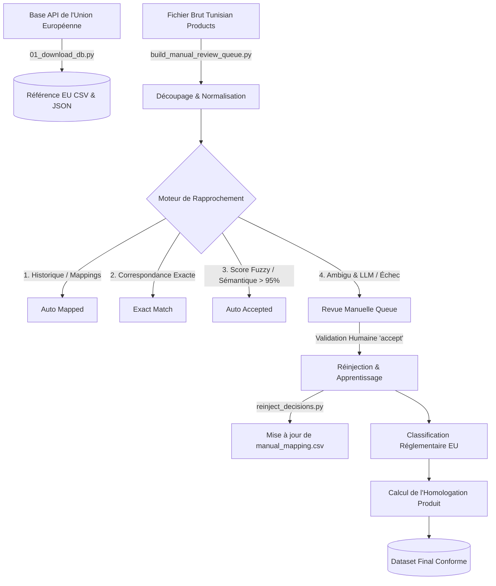

# Document Méthodologique : Workflow de Réconciliation des Pesticides

Ce document présente en détail le fonctionnement méthodologique et technique du pipeline de réconciliation des données de pesticides tunisiens avec la base de données des substances actives de l'Union Européenne.

---

## Architecture Générale du Workflow

---

## Étape 1 : Acquisition de la Référence Européenne (`01_download_db.py`)

* **Objectif** : Télécharger et conserver localement une copie intégrale de la base de données officielle européenne de la DG SANTE.
* **Algorithme et Robustesse** :
  * Le script interroge l'API REST `https://api.datalake.sante.service.ec.europa.eu`.
  * Il gère le **ratelimit** (erreurs `429 Too Many Requests`) en lisant l'en-tête HTTP `Retry-After` renvoyé par le serveur de l'UE pour suspendre proprement les requêtes.
  * Il effectue jusqu'à 5 tentatives de téléchargement avec un **backoff exponentiel** en cas de panne temporaire (erreurs de serveurs `5xx`).
  * **Sortie** : Sauvegarde le NDJSON brut dans `data/reference/eu_active_substances_full.json` (auditabilité) et compile le tableau plat de référence dans `data/reference/eu_active_substances_full.csv`.

---

## Étape 2 : Préparation et Normalisation des Produits (`build_manual_review_queue.py`)

Les substances actives renseignées dans le catalogue tunisien (`data/input/pesticides_tn_checked2.csv`) sont souvent des mélanges, contiennent des impuretés orthographiques, des accents ou des dosages. Le pipeline prépare ces chaînes selon les étapes suivantes :

### A. Découpage des Formules de Mélange (`substance_splitting.py`)
* Le pipeline détecte et sépare les principes actifs multiples séparés par des caractères comme `+`, `;`, `/` ou des conjonctions (`et`, `and`).
* *Exemple* : `"Azadirachtine + Huile de neem"` $\rightarrow$ `["Azadirachtine", "Huile de neem"]`.

### B. Nettoyage Orthographique et Standardisation (`text_normalization.py`)
1. **Retrait des Doses et Unités** : Les indications de dosage et d'unités de mesure sont éliminées via des expressions régulières (ex: `10%`, `50 g/l`, `1x10^10 spores/g`, `WP`, `EC`).
2. **Traduction Chimique** : Les termes en français sont traduits en anglais pour s'aligner sur la base de données européenne (ex: `huile` $\rightarrow$ `oil`, `cuivre` $\rightarrow$ `copper`, `sel` $\rightarrow$ `salt`).
3. **Correction de Variantes** : Les coquilles et variations d'appellation fréquentes sont corrigées (ex: `abamectine` $\rightarrow$ `abamectin`, `lambdacyhalothrine` $\rightarrow$ `lambda-cyhalothrin`).
4. **Simplification** : Les accents sont retirés, le texte est passé en minuscules, et les parenthèses ainsi que les espaces multiples sont normalisés.

---

## Étape 3 : Moteur de Correspondance Multi-Niveaux

Pour chaque substance active extraite de chaque produit commercial, le pipeline applique une cascade de règles, de la plus déterministe à la plus probabiliste :

1. **Vérification de l'Historique de Mapping** : Le script recherche le nom normalisé dans le fichier [manual_mapping.csv](file:///c:/Ba7ath_scripts/pesticides/data/interim/manual_mapping.csv) qui stocke l'historique des validations humaines précédentes. S'il y a correspondance, la substance est validée en tant que `"auto_mapped"`.
2. **Correspondance Exacte** : Le nom normalisé est comparé directement avec la liste des noms normalisés de l'UE. En cas de correspondance parfaite, le statut est `"exact"`.
3. **Seuil de Score Fuzzy & Sémantique** :
   * Le script calcule le score de proximité textuelle (`rapidfuzz`) et, si activé, le score de similarité vectorielle (embeddings locaux Ollama `nomic-embed-text`).
   * Si le score fusionné est supérieur ou égal à **95%**, la correspondance est automatiquement approuvée sous le type `"auto_accept_high_confidence"`.
4. **Arbitrage LLM Local (Optionnel)** : Si le score est intermédiaire (entre 40% et 75%) et que Ollama est actif, un LLM local (`qwen3:14b`) tente de résoudre l'ambiguïté à l'aide d'une invite structurée en JSON (explicitant les synonymes et les sels de la substance). Le LLM a interdiction stricte de proposer un candidat en dehors de la shortlist proposée.
5. **Génération de la file de revue** : Tout produit contenant au moins une substance active non résolue (score < 95%) est dirigé vers la file d'attente manuelle [manual_review_queue.csv](file:///c:/Ba7ath_scripts/pesticides/data/interim/manual_review_queue.csv). Le fichier présente les produits par ligne, avec les 5 meilleurs candidats proposés pour chaque substance active non résolue.

---

## Étape 4 : Revue Manuelle par l'Opérateur

* L'utilisateur ouvre le fichier `data/interim/manual_review_queue.csv` dans son tableur préféré.
* Pour chaque substance en suspens (indiquée par `review` ou `review_accept_high_score`) :
  * L'utilisateur vérifie les suggestions et modifie la décision dans la colonne `review_decision_i` par **`accept`** ou **`reject`**.
  * S'il accepte, il copie/colle le nom officiel de l'UE suggéré dans la colonne `review_match_name_i`. Des hyperliens vers la base de données de l'UE sont automatiquement insérés dans le CSV pour lui permettre de vérifier rapidement les fiches.
  * Il enregistre et ferme le fichier CSV.

---

## Étape 5 : Réinjection, Apprentissage et Homologation (`reinject_decisions.py`)

Lorsque l'utilisateur lance l'étape de réinjection, le pipeline assemble les décisions et calcule la conformité finale du catalogue :

### A. Boucle d'Apprentissage (Feedback Loop)
* Le script de réinjection extrait chaque décision `"accept"` de la file d'attente manuelle.
* Il inscrit ces nouvelles associations (`Nom Tunisien` $\rightarrow$ `Nom Officiel EU`) dans le fichier [manual_mapping.csv](file:///c:/Ba7ath_scripts/pesticides/data/interim/manual_mapping.csv).
* **Bénéfice** : Lors du prochain build de la file, ces substances seront résolues automatiquement sans aucune action humaine.

### B. Classification Réglementaire Fine (`regulatory_classifier.py`)
Le pipeline enrichit les données avec le contexte réglementaire européen de chaque substance :
* **Calcul des dates** : Analyse et standardisation des dates de début et de fin d'autorisation. Si la date actuelle dépasse la date d'expiration européenne, le statut de la substance est ré-évalué de `"Approved"` à `"Expired"`.
* **Indicateurs de substitution et de risque** :
  * Détection si la substance est qualifiée de "Candidat à la substitution" (`candidate_for_substitution`).
  * Détection si la substance est à "Faible risque" (`low_risk_active_substance`) ou si c'est une "Substance de base" (`basic_substance`).
  * Calcul du niveau de risque global de la substance : `"low"`, `"medium"` ou `"high"` (le risque passe à `"high"` si elle est interdite, en substitution, ou retirée).

### C. Invariant d'Homologation du Produit Commercial
* **Règle d'Invariant** : Un produit commercial complet (qui peut contenir plusieurs substances) n'obtient l'approbation finale (`product_is_approved = True`) **que si toutes ses substances actives non vides** sont individuellement associées à des substances de référence approuvées par l'UE (statut exact `"Approved"`).
* Si une seule substance active du produit est rejetée, expirée, interdite ou non approuvée, le produit entier est marqué `product_is_approved = False`.

### D. Export du Catalogue Final
Toutes les métadonnées consolidées et les statuts détaillés sont enregistrés dans le catalogue final [pesticides_tn_clean.csv](file:///c:/Ba7ath_scripts/pesticides/data/output/pesticides_tn_clean.csv).
