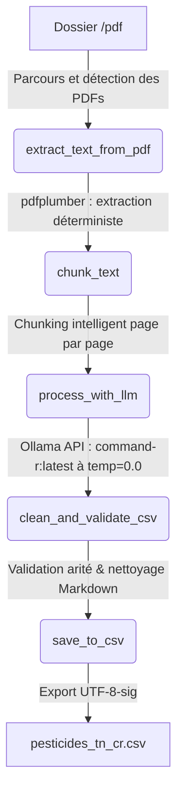

# Walkthrough - Extraction et Structuration des Pesticides avec Ollama

Ce document détaille l'implémentation du script d'extraction et de structuration documentaire des pesticides tunisiens à partir de listes PDF officielles via un LLM local.

## Fichier créé
- [extract_pesticides_ollama.py](file:///c:/Ba7ath_scripts/pesticides/scripts/extract_pesticides_ollama.py) : Script principal implémentant le pipeline de traitement.

---

## Architecture du Pipeline

Le script réalise les étapes suivantes de manière modulaire et sécurisée :



### 1. Lecture et Extraction Déterministe (`extract_text_from_pdf`)
- Utilise `pdfplumber` pour lire de façon déterministe le texte page par page.
- Gère la journalisation des pages vides ou illisibles et les exceptions de lecture.

### 2. Chunking Intelligent (`chunk_text`)
- Découpe le texte par page pour préserver l'intégrité des tableaux d'une même page.
- Si le texte d'une page dépasse un seuil maximal de caractères (5000 caractères par défaut), il est découpé par groupes de lignes. Cela empêche de tronquer des enregistrements au milieu d'un produit commercial.

### 3. Requêtage LLM Local (`process_with_llm`)
- Interroge l'API Ollama locale (`http://localhost:11434/api/generate`) avec le modèle `command-r:latest`.
- Fixe strictement le paramètre `temperature` à `0.0` pour éliminer l'aspect aléatoire.
- Utilise `stream: false` pour obtenir des réponses complètes.
- Implémente un mécanisme de retry (3 tentatives) avec backoff exponentiel en cas de latence ou timeout de l'API locale.

### 4. Nettoyage et Validation CSV (`clean_and_validate_csv`)
- **Nettoyage Markdown** : Retire les blocs de code markdown (comme ` ```csv ` ou ` ``` `).
- **Filtrage du bavardage** : Élimine les lignes de conversation (sans point-virgule `;`).
- **Parsing standard** : Utilise le module standard `csv.reader` avec le séparateur `;` pour gérer correctement les guillemets et caractères spéciaux.
- **Arity Check** : Vérifie que chaque ligne contient exactement 4 colonnes (`Substance(s) active(s)`, `P.Comm`, `Société`, `Fabricant`).
  - Si < 4 colonnes, la ligne est complétée par `'Non spécifié'`.
  - Si > 4 colonnes, elle est tronquée.
- **Normalisation** : Convertit les valeurs vides ou pseudo-nulles (`None`, `null`, `nan`) en `'Non spécifié'`.

### 5. Consolidation et Exportation (`save_to_csv`)
- Fusionne toutes les lignes extraites.
- Génère un en-tête unique au début du fichier final.
- Exporte les données sous `data/input/pesticides_tn_cr.csv` avec l'encodage `utf-8-sig` (permettant une compatibilité immédiate des caractères accentués sous Microsoft Excel et Google Sheets).

---

## Validation et Tests

Un test de compilation a été exécuté avec succès :
```bash
python -m py_compile scripts/extract_pesticides_ollama.py
```
Le script s'est compilé sans aucune erreur de syntaxe.
